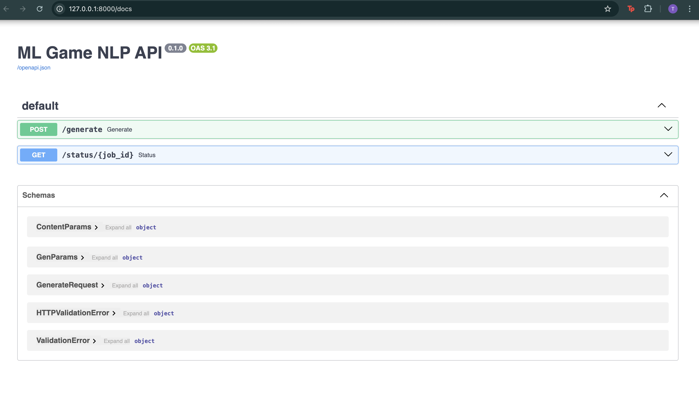

# ML Game NLP

A sandbox-style project exploring how machine learning can generate content for games.  
The first focus is on **fantasy text generation** — lore snippets, quest hooks, and names — using small, CPU-friendly models.

## Features
- FastAPI backend with async endpoints
- In-memory job queue for handling multiple generation requests
- Configurable generation parameters (temperature, top_p, max tokens, seed, etc.)
- Simple metrics tracking (length, repetition, runtime)
- Experiment framework with parameter sweeps and CSV logging

## Project Structure
```
ml-game-nlp/
├── src/
│ ├── app.py # FastAPI app + routes
│ ├── queue.py # In-memory job queue
│ ├── generator.py # Text generation logic
│ ├── prompts.py # Prompt builder functions
│ ├── metrics.py # Basic output metrics
│ └── experiments.py # Parameter sweep runner
├── outputs/ # Saved generations and CSV experiment logs
├── docs/ # Experiment notes and reports
└── README.md
```




### Results
- Sample outputs: see `outputs/samples/`
- Parameter sweep CSV: `outputs/experiments/lore_grid.csv`
- Short notes: `docs/experiments.md`


## Setup
```bash
# Clone the repo
git clone https://github.com/tanisha-raha/ml-game-nlp.git
cd ml-game-nlp

# Create a virtual environment
python3 -m venv .venv
source .venv/bin/activate  # Mac/Linux
# or .venv\Scripts\activate on Windows

# Install dependencies
pip install -r requirements.txt

